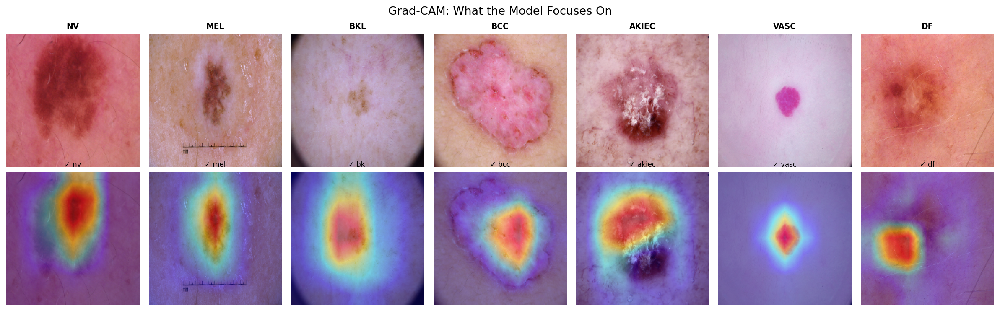
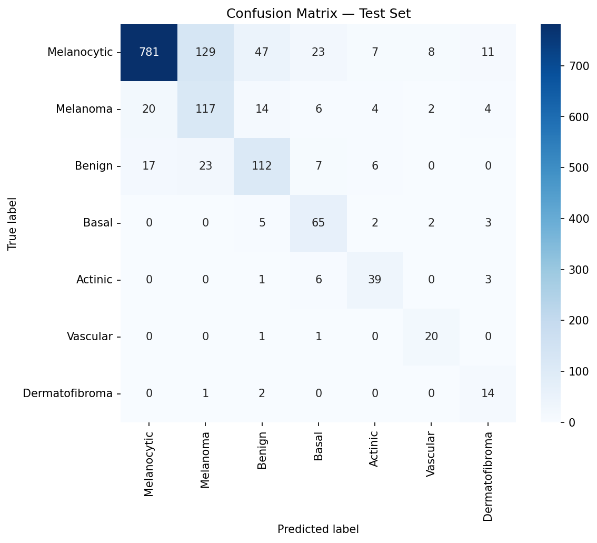
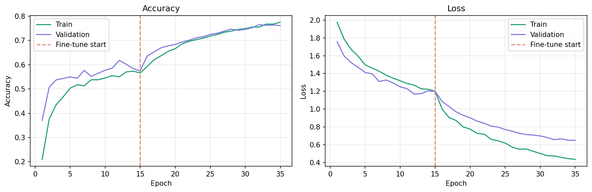

# Skin Cancer Detection with Deep Learning
### Multi-class dermoscopy image classification using EfficientNetB0 transfer learning

   

---

## Overview

This project applies convolutional neural networks to the early detection of skin cancer from dermoscopy images — a clinically significant problem where delayed diagnosis substantially worsens patient outcomes. Using transfer learning from EfficientNetB0 pretrained on ImageNet, the model classifies skin lesions into 7 diagnostic categories with **76.4% test accuracy** and **0.961 AUC-ROC**, performance comparable to published benchmarks on this dataset.

Gradient-weighted Class Activation Mapping (Grad-CAM) is used to generate interpretable heatmaps that visualize model attention, confirming the network focuses on clinically relevant lesion features rather than background artifacts.

This project was developed as a Biomedical Engineering science fair research project.

---

## Results

| Metric | Score |
|--------|-------|
| Test Accuracy | 76.4% |
| AUC-ROC (macro, one-vs-rest) | 0.961 |
| Best Validation Accuracy | 76.5% |

### Per-class Performance

| Class | Precision | Recall | F1 |
|-------|-----------|--------|----|
| Melanocytic nevi | 0.95 | 0.78 | 0.86 |
| Melanoma | 0.43 | 0.70 | 0.54 |
| Benign keratosis | 0.62 | 0.68 | 0.65 |
| Basal cell carcinoma | 0.60 | 0.84 | 0.70 |
| Actinic keratosis | 0.67 | 0.80 | 0.73 |
| Vascular lesion | 0.62 | 0.91 | 0.74 |
| Dermatofibroma | 0.40 | 0.82 | 0.54 |

---

## Grad-CAM Explainability

Grad-CAM heatmaps confirm the model focuses on diagnostically relevant regions — the central lesion body, irregular borders, and textural features — consistent with the ABCDE clinical criteria used by dermatologists. All 7 sample predictions shown below are correct.

*Red = highest model attention, blue = lowest*





---

## Dataset

**HAM10000** (Human Against Machine with 10000 training images)  
- 10,015 dermoscopy images across 7 lesion classes  
- Source: [Kaggle — skin-cancer-mnist-ham10000](https://www.kaggle.com/datasets/kmader/skin-cancer-mnist-ham10000)  
- Original paper: Tschandl et al., 2018 — *The HAM10000 dataset, a large collection of multi-source dermatoscopic images of common pigmented skin lesions*

### Class Distribution
| Class | Code | Count |
|-------|------|-------|
| Melanocytic nevi (benign) | nv | 6,705 |
| Melanoma (malignant) | mel | 1,113 |
| Benign keratosis | bkl | 1,099 |
| Basal cell carcinoma | bcc | 514 |
| Actinic keratosis | akiec | 327 |
| Vascular lesion | vasc | 142 |
| Dermatofibroma | df | 115 |

---

## Methods

### Model Architecture
- **Base model:** EfficientNetB0 pretrained on ImageNet (frozen during head training)
- **Head:** GlobalAveragePooling2D → Dropout(0.3) → Dense(7, softmax)
- **Training strategy:** Two-phase transfer learning
  - Phase A: Head-only training, lr = 1e-4, 20 epochs
  - Phase B: Full model fine-tuning, lr = 1e-5, 20 epochs

### Data Pipeline
- Images resized to 224×224 pixels
- Augmentation: random horizontal/vertical flip, brightness shift
- Class imbalance handled via computed class weights
- Stratified 70% / 15% / 15% train / validation / test split

### Explainability
- Gradient-weighted Class Activation Mapping (Grad-CAM) applied to the `top_conv` layer of EfficientNetB0
- Heatmaps overlaid on original images at 40% opacity

---

## How to Run

This project runs entirely in Google Colab with a free T4 GPU.

1. Open [Google Colab](https://colab.research.google.com)
2. Upload `skin_cancer_project.ipynb`
3. Set runtime: `Runtime → Change runtime type → T4 GPU`
4. Run the Recovery Cell at the top (mounts Drive, loads all variables)
5. Run cells top to bottom

### Requirements
All libraries are pre-installed in Colab. For local use:
```
tensorflow>=2.15
opencv-python
matplotlib
numpy
pandas
scikit-learn
seaborn
kaggle
```

---

## Project Structure

```
skin_cancer_project/
│
├── skin_cancer_project.ipynb   # Main notebook (all phases)
├── README.md                   # This file
│
└── outputs/                    # Saved to Google Drive
    ├── best_model.keras        # Trained model weights
    ├── fig_class_distribution.png
    ├── fig_sample_images.png
    ├── fig_training_curves.png
    ├── fig_confusion_matrix.png
    └── fig_gradcam.png
```

---

## Key Findings

1. **Strong overall discrimination:** AUC-ROC of 0.961 indicates the model can reliably rank malignant lesions above benign ones — the core clinical requirement for a screening tool.

2. **Clinically meaningful attention:** Grad-CAM heatmaps show the model focuses on lesion borders, texture, and pigmentation patterns consistent with the ABCDE dermoscopy criteria, rather than background skin or image artifacts.

3. **Class imbalance reflects real-world challenge:** Performance on rare classes (dermatofibroma: 17 test samples, dermatofibroma: 40% precision) is lower than common classes — a finding consistent with published literature and an important limitation for any clinical application.

4. **Melanoma recall of 70%:** In a screening context, recall is more clinically important than precision for melanoma — missing a true positive is far more dangerous than a false alarm. 70% recall on a dataset this imbalanced is a meaningful result.

---

## Limitations & Ethical Considerations

- **Not a clinical tool.** This model has not undergone clinical validation and should not be used for medical diagnosis.
- **Dataset bias.** HAM10000 was collected from specific clinical sites; performance may differ on images from other populations or imaging devices.
- **Class imbalance.** Rare lesion types are underrepresented, limiting performance on those classes despite class weighting.
- **Image quality dependency.** The model was trained on professional dermoscopy images; smartphone photos may produce unreliable results.

---

## Future Work

- Expand to larger, more diverse datasets (ISIC 2019/2020)
- Incorporate patient metadata (age, lesion location, sex) as additional features
- Evaluate on prospective clinical data
- Explore mobile deployment for point-of-care screening in low-resource settings
- Test ensemble methods combining multiple architectures

---

## References

1. Tschandl, P., Rosendahl, C., & Kittler, H. (2018). The HAM10000 dataset. *Scientific Data*, 5, 180161.
2. Tan, M., & Le, Q. (2019). EfficientNet: Rethinking model scaling for convolutional neural networks. *ICML*.
3. Selvaraju, R. R., et al. (2017). Grad-CAM: Visual explanations from deep networks. *ICCV*.

---

*Developed as a Biomedical Engineering science fair research project.*
