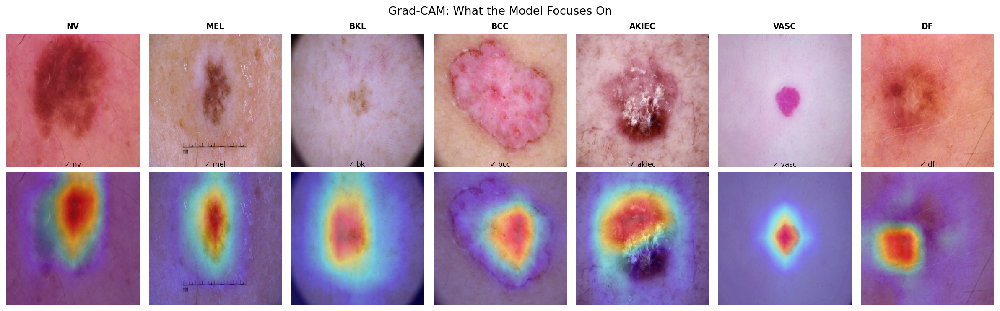
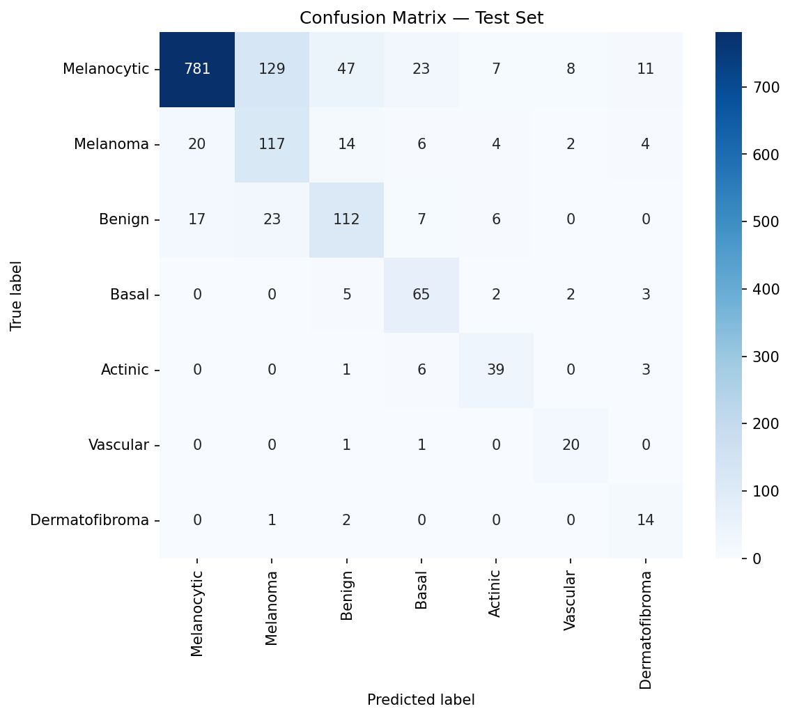
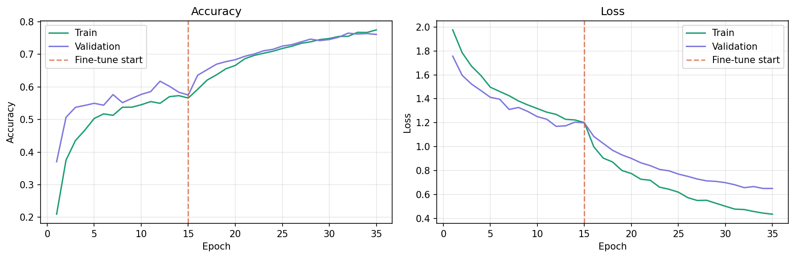
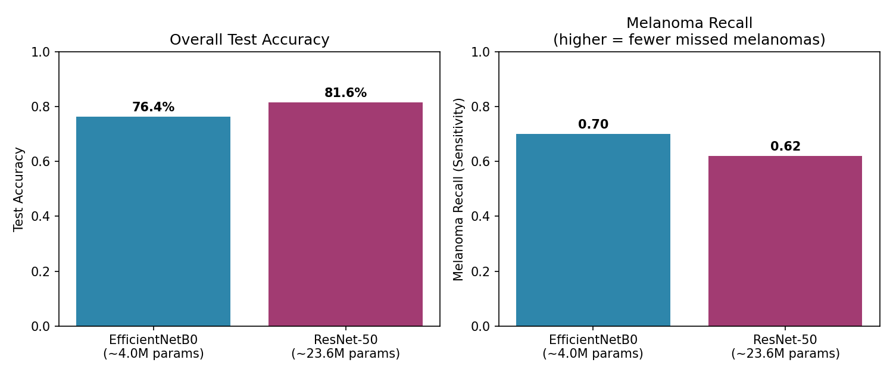
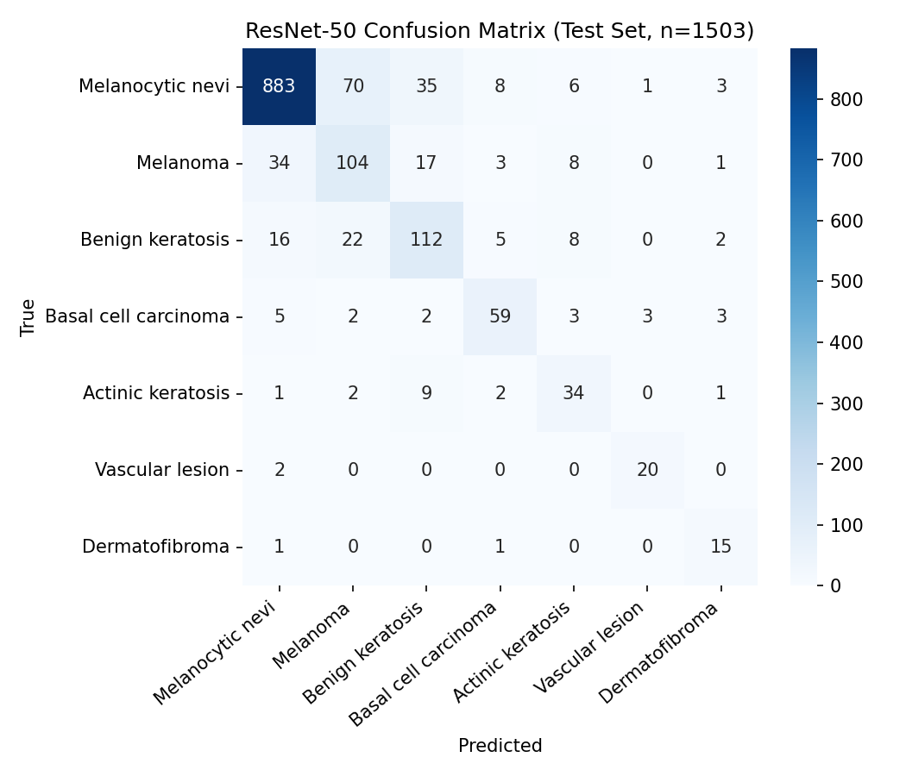
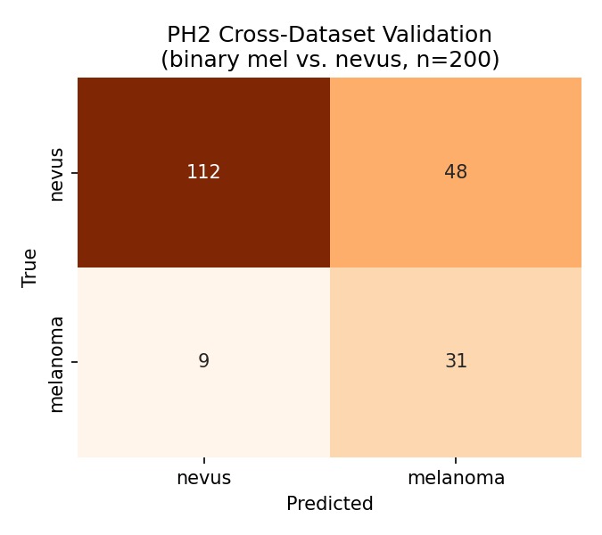

# Skin Cancer Detection with Deep Learning
### Multi-class dermoscopy image classification using EfficientNetB0 transfer learning

   

---

## Overview

This project applies convolutional neural networks to the early detection of skin cancer from dermoscopy images — a clinically significant problem where delayed diagnosis substantially worsens patient outcomes. Using transfer learning from EfficientNetB0 pretrained on ImageNet, the model classifies skin lesions into 7 diagnostic categories with **76.4% test accuracy** and **0.961 AUC-ROC**, performance comparable to published benchmarks on this dataset.

To contextualize this result, a **ResNet-50 baseline** was trained under an identical protocol (same split, same two-phase schedule) for direct comparison, and the model was evaluated on **PH2**, an independent external dataset, to test generalization beyond HAM10000. See [Model Comparison](#model-comparison-efficientnetb0-vs-resnet-50) and [Cross-Dataset Validation](#cross-dataset-validation-ph2) below.

Gradient-weighted Class Activation Mapping (Grad-CAM) is used to generate interpretable heatmaps that visualize model attention, confirming the network focuses on clinically relevant lesion features rather than background artifacts.

This project was developed as a Biomedical Engineering science fair research project.

---

## Results

| Metric | Score |
|--------|-------|
| Test Accuracy | 76.4% |
| AUC-ROC (macro, one-vs-rest) | 0.961 |
| Best Validation Accuracy | 76.5% |

### Per-class Performance

| Class | Precision | Recall | F1 |
|-------|-----------|--------|----|
| Melanocytic nevi | 0.95 | 0.78 | 0.86 |
| Melanoma | 0.43 | 0.70 | 0.54 |
| Benign keratosis | 0.62 | 0.68 | 0.65 |
| Basal cell carcinoma | 0.60 | 0.84 | 0.70 |
| Actinic keratosis | 0.67 | 0.80 | 0.73 |
| Vascular lesion | 0.62 | 0.91 | 0.74 |
| Dermatofibroma | 0.40 | 0.82 | 0.54 |

---

## Grad-CAM Explainability

Grad-CAM heatmaps confirm the model focuses on diagnostically relevant regions — the central lesion body, irregular borders, and textural features — consistent with the ABCDE clinical criteria used by dermatologists. All 7 sample predictions shown below are correct.

*Red = highest model attention, blue = lowest*





---

## Model Comparison: EfficientNetB0 vs. ResNet-50

To check whether EfficientNetB0 was an arbitrary choice or an informed one, a ResNet-50 model
was trained from scratch under the **exact same protocol**: same stratified 70/15/15 split
(`seed=42`), same class weighting, same two-phase schedule (Phase A: frozen base, `lr=1e-4`;
Phase B: full fine-tune, `lr=1e-5`; both phases with `patience=6` early stopping on
`val_accuracy`).

| Metric | EfficientNetB0 | ResNet-50 |
|--------|---------------|-----------|
| Test Accuracy | 76.4% | **81.6%** |
| AUC-ROC (macro) | 0.961 | **0.9633** |
| Total Parameters | ~4.0M | ~23.6M |
| **Melanoma Recall (Sensitivity)** | **0.70** | 0.62 |
| Melanoma Precision | 0.43 | 0.52 |




**Why EfficientNetB0 was kept as the primary model despite lower raw accuracy:** ResNet-50 wins
on overall accuracy by ~5 points, largely on the strength of its majority-class (melanocytic
nevi) performance, using **~6x more parameters**. But in a screening context, the cost of a missed
melanoma vastly outweighs the cost of a false alarm — so melanoma recall is the more
clinically meaningful metric. EfficientNetB0 catches 70% of melanomas in the test set versus
ResNet-50's 62%, making it the better-justified choice for this application even though it's
the smaller, "weaker" model by accuracy alone. This is reported as a deliberate tradeoff, not
hidden in favor of the headline accuracy number.

Full results: [`resnet50_results.json`](resnet50_results.json)

---

## Cross-Dataset Validation (PH2)

HAM10000 test accuracy measures in-distribution performance — same imaging protocol, same
source clinics. To estimate how the model performs on lesion images it has never been exposed
to in any form, the trained EfficientNetB0 model (no retraining) was evaluated on
**[PH2](https://www.fc.up.pt/addi/ph2%20database.html)**, an independent 200-image dermoscopic
dataset from a different clinical source (Hospital Pedro Hispano, Portugal).

**Important methodological note:** PH2 only labels images as common nevus / atypical nevus /
melanoma — it does not have the other 5 HAM10000 classes. This is therefore a **binary
evaluation (melanoma vs. nevus)**, not a 7-class evaluation. The model's `mel` and `nv` output
probabilities are isolated and renormalized to sum to 1 (`p_mel / (p_mel + p_nv)`), then
thresholded at 0.5. **This number is not directly comparable to the 76.4% in-distribution
7-class accuracy** — it isolates melanoma-vs-nevus discrimination specifically under domain
shift, which is a narrower and arguably more clinically central question.

| Metric | Value |
|--------|-------|
| n | 200 (160 nevus, 40 melanoma) |
| Accuracy (binary) | 71.5% |
| AUC-ROC | 0.824 |
| Melanoma Sensitivity (Recall) | 0.78 |
| Melanoma Precision | 0.39 |



**Interpretation:** Accuracy drops from 76.4% (in-distribution, 7-class) to 71.5%
(cross-dataset, binary) — a meaningful generalization gap, as expected when moving to a new
imaging source. Notably, melanoma *sensitivity* actually holds up well (0.78) — the model
under-predicts nevus more than it misses melanomas, which is the safer failure mode for a
screening tool, though the low melanoma precision (0.39) means a real deployment would need a
human-in-the-loop review step rather than acting on the model's output directly. This result is
reported as an honest test of generalization, not cherry-picked.

Full results: [`ph2_results.json`](ph2_results.json) · Full code: [`model_comparison_and_validation.ipynb`](model_comparison_and_validation.ipynb)

---

## Dataset

**HAM10000** (Human Against Machine with 10000 training images)  
- 10,015 dermoscopy images across 7 lesion classes  
- Source: [Kaggle — skin-cancer-mnist-ham10000](https://www.kaggle.com/datasets/kmader/skin-cancer-mnist-ham10000)  
- Original paper: Tschandl et al., 2018 — *The HAM10000 dataset, a large collection of multi-source dermatoscopic images of common pigmented skin lesions*

### Class Distribution
| Class | Code | Count |
|-------|------|-------|
| Melanocytic nevi (benign) | nv | 6,705 |
| Melanoma (malignant) | mel | 1,113 |
| Benign keratosis | bkl | 1,099 |
| Basal cell carcinoma | bcc | 514 |
| Actinic keratosis | akiec | 327 |
| Vascular lesion | vasc | 142 |
| Dermatofibroma | df | 115 |

---

## Methods

### Model Architecture
- **Base model:** EfficientNetB0 pretrained on ImageNet (frozen during head training)
- **Head:** GlobalAveragePooling2D → Dropout(0.3) → Dense(7, softmax)
- **Training strategy:** Two-phase transfer learning
  - Phase A: Head-only training, lr = 1e-4, 20 epochs
  - Phase B: Full model fine-tuning, lr = 1e-5, 20 epochs

### Data Pipeline
- Images resized to 224×224 pixels
- Augmentation: random horizontal/vertical flip, brightness shift
- Class imbalance handled via computed class weights
- Stratified 70% / 15% / 15% train / validation / test split

### Explainability
- Gradient-weighted Class Activation Mapping (Grad-CAM) applied to the `top_conv` layer of EfficientNetB0
- Heatmaps overlaid on original images at 40% opacity

---

## How to Run

This project runs entirely in Google Colab with a free T4 GPU.

1. Open [Google Colab](https://colab.research.google.com)
2. Upload `skin_cancer_project.ipynb`
3. Set runtime: `Runtime → Change runtime type → T4 GPU`
4. Run the Recovery Cell at the top (mounts Drive, loads all variables)
5. Run cells top to bottom

### Requirements
All libraries are pre-installed in Colab. For local use:
```
tensorflow>=2.15
opencv-python
matplotlib
numpy
pandas
scikit-learn
seaborn
kaggle
```

---

## Project Structure

```
skin_cancer_project/
│
├── skin_cancer_project.ipynb              # Main notebook (EfficientNetB0 training, all phases)
├── model_comparison_and_validation.ipynb  # ResNet-50 baseline + PH2 cross-dataset validation
├── resnet50_results.json                  # ResNet-50 metrics, confusion matrix, per-class scores
├── ph2_results.json                       # PH2 cross-dataset validation metrics
├── README.md                              # This file
│
├── fig_class_distribution.png
├── fig_sample_images.png
├── fig_training_curves.png
├── fig_confusion_matrix.png               # EfficientNetB0 confusion matrix
├── fig_gradcam.png
├── fig_model_comparison.png               # EfficientNetB0 vs ResNet-50
├── fig_resnet50_confusion_matrix.png
├── fig_ph2_confusion_matrix.png
│
└── outputs/                    # Saved to Google Drive
    ├── best_model.keras                # EfficientNetB0 trained weights
    └── best_model_resnet50.keras       # ResNet-50 trained weights
```

---

## Key Findings

1. **Strong overall discrimination:** AUC-ROC of 0.961 indicates the model can reliably rank malignant lesions above benign ones — the core clinical requirement for a screening tool.

2. **Clinically meaningful attention:** Grad-CAM heatmaps show the model focuses on lesion borders, texture, and pigmentation patterns consistent with the ABCDE dermoscopy criteria, rather than background skin or image artifacts.

3. **Class imbalance reflects real-world challenge:** Performance on rare classes (dermatofibroma: 17 test samples, dermatofibroma: 40% precision) is lower than common classes — a finding consistent with published literature and an important limitation for any clinical application.

4. **Melanoma recall of 70%:** In a screening context, recall is more clinically important than precision for melanoma — missing a true positive is far more dangerous than a false alarm. 70% recall on a dataset this imbalanced is a meaningful result.

5. **Accuracy isn't the right single metric to optimize:** A larger model (ResNet-50, ~23.6M params) beat EfficientNetB0 on raw accuracy (81.6% vs. 76.4%) but caught fewer actual melanomas (62% vs. 70% recall). Choosing EfficientNetB0 despite the lower headline accuracy was a deliberate decision based on the clinically relevant metric, not an oversight.

6. **Generalization gap under domain shift:** Accuracy dropped from 76.4% (in-distribution) to 71.5% (PH2, cross-dataset, binary mel-vs-nevus) — expected behavior when testing on images from a different clinical source, and a result reported transparently rather than omitted. Melanoma sensitivity held up better (0.78) than accuracy alone would suggest.

---

## Limitations & Ethical Considerations

- **Not a clinical tool.** This model has not undergone clinical validation and should not be used for medical diagnosis.
- **Dataset bias.** HAM10000 was collected from specific clinical sites; performance may differ on images from other populations or imaging devices. The PH2 cross-dataset result (71.5% binary accuracy, see above) is direct evidence of this gap.
- **Class imbalance.** Rare lesion types are underrepresented, limiting performance on those classes despite class weighting.
- **Image quality dependency.** The model was trained on professional dermoscopy images; smartphone photos may produce unreliable results.
- **PH2 evaluation scope.** The PH2 validation is restricted to a binary melanoma-vs-nevus task because PH2's label set doesn't cover all 7 HAM10000 classes — it does not establish cross-dataset performance on basal cell carcinoma, actinic keratosis, or the other 5 classes.

---

## Future Work

- Expand to larger, more diverse datasets (ISIC 2019/2020)
- Incorporate patient metadata (age, lesion location, sex) as additional features
- Evaluate on additional external datasets covering the full 7-class taxonomy (PH2 only covers melanoma/nevus)
- Explore mobile deployment for point-of-care screening in low-resource settings
- Ensemble EfficientNetB0 and ResNet-50 to combine ResNet-50's higher precision with EfficientNetB0's higher melanoma recall

---

## References

1. Tschandl, P., Rosendahl, C., & Kittler, H. (2018). The HAM10000 dataset. *Scientific Data*, 5, 180161.
2. Tan, M., & Le, Q. (2019). EfficientNet: Rethinking model scaling for convolutional neural networks. *ICML*.
3. Selvaraju, R. R., et al. (2017). Grad-CAM: Visual explanations from deep networks. *ICCV*.

---

*Developed as a Biomedical Engineering science fair research project.*
